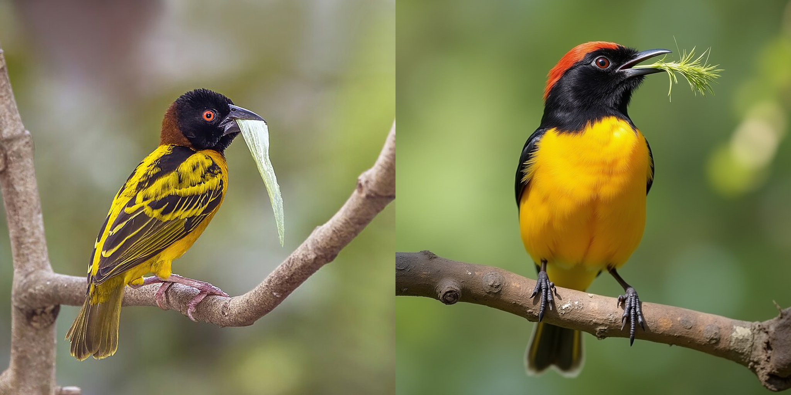

ComfyUI-llm-tools
==================

Patrick Wagstrom &lt;160672+pridkett@users.noreply.github.com&gt;

August 2024

Overview
========

This project is inspired by [this Reddit post, where /u/lazyspock used ChatGPT 4o to describe pictures and then fed that to Flux for image generation](https://old.reddit.com/r/StableDiffusion/comments/1elb3mp/got_pictures_from_pexelscom_asked_chatgpt_4o_to/). Being inspired and having some free time on my hands, I decided to see if I could turn that into a node for ComfyUI, so you can use GPT-4o to generate your prompts and then do whatever else you want to do with it.

Example Output
==============

I used an image of the [Village Weaver bird from Wikipedia](https://en.wikipedia.org/wiki/Village_weaver#/media/File:Village_weaver_(Ploceus_cucullatus_cucullatus)_male_with_leaf.jpg) as my example image. Using that and the default prompt, created this output image below:



Nodes
=====

Currently this package provides four different nodes.

* **OpenAI Vision**: The reason why I started this in the first place. Given an image, an API key, model name, and prompt, it will invoke the GPT 4o model to execute the prompt. My normal use case for this is to experiment with feeding Flux LLM generated prompts.

* **Load Environment Variable:** I needed a way to load the API key into a ComfyUI workflow. This seemed like the easiest way for me. I store my API key in the `OPENAI_API_KEY` environment variable when I run ComfyUI, making it easy to grab the variable and pipe it into the `OpenAI Vision` node.

* **Image Dimensions:** This wasn't strictly needed for this package, but I wanted to find a way to ensure that I was generating images with the same aspect ratio as the original image. Normally what I do is I use the Constrain Image node from ComfyUI-Custom-Scripts to make sure that no dimension is greater than 1024. I then use the `Image Dimensions` node to grab the width and height and pipe those into the `EmptySD3LatentImage` node.

* **Side by Side Images:** Finally, I wanted a way to visualize the original and generated image side-by-side. This node takes a single input base image and a potential array of images and generates composite images with the left side as the base image and the right side as the generated image.

Example Workflow
================

You can see all of these in action by dragging [this example output PNG](docs/output.png) into ComfyUI. It's a modified version of the default Flux UI that should bring in all the nodes for you. Note, you must have `OPENAI_API_KEY` set as an environment variable with your key for this to work.

Default Prompt
==============

I'm not 100% sure if this is the best prompt, but here's what I've found works pretty well. I've noticed that GPT-4o often times does not like identifying celebrities, so even if Flux could recreate them, it might not have the name of the celebrity to go from. That's not a bad thing, but considering it missed things like "Queen Elizabeth II" in some of my testing, that's a little non-ideal.

```
Describe the image as a prompt than an AI image generator could use to generate a similar image. Be detailed. Note if the image is a photograph, diagram, illustration, painting, etc. Provide details about paintings including the style of art and possible artist. Describe attributes of the photograph, such as being award winning, nature photography, portrait, snapshot, etc. Make note of specific brands, logos, locations, scenes, and individuals if it is possible to identify them. Describe any text in the image - including the size, location, color, and style of the text. Do not include any superfluous text in the output, such as headers or statements like "Create an image" or "This image describes" - the generation model does not need those.
```

Caveats / Bugs / etc
====================

This is my first time creating nodes for ComfyUI, so it's likely that I made some silly mistakes and that these things are not well fleshed out. I may eventually do more of that as I play with ComfyUI more in the future.

License
=======

Copyright (c) 2024 Patrick Wagstrom

Licensed under the terms of the MIT license
